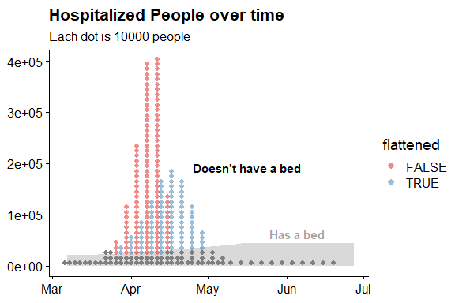

dotplots
================

## Libraries and setup

``` r
library(tidyverse)
library(cowplot)

theme_set(theme_cowplot())
```

## Read in data

Here are predictions from a simple model from <https://covidactnow.org/>
as of March 24:

``` r
df = read_csv("covid_act_now.csv", col_types = cols(
  date = col_date(),
  not_flattened = col_integer(),
  flattened = col_integer(),
  beds = col_integer()
))

df
```

    ## # A tibble: 29 x 4
    ##    date       not_flattened flattened  beds
    ##    <date>             <int>     <int> <int>
    ##  1 2020-03-07            76        76 21010
    ##  2 2020-03-11           220       220 21010
    ##  3 2020-03-15           732       732 21010
    ##  4 2020-03-19          5360      5361 22060
    ##  5 2020-03-23         20769     20775 23163
    ##  6 2020-03-27         48888     34639 24322
    ##  7 2020-03-31        111019     56312 25538
    ##  8 2020-04-04        231190     87732 26814
    ##  9 2020-04-08        390700    127428 28155
    ## 10 2020-04-12        401125    165559 29563
    ## # ... with 19 more rows

And a long-format version for hospitalizations:

``` r
hosp = df %>%
  pivot_longer(c(not_flattened, flattened), names_to = "model", values_to = "hospitalized") %>%
  mutate(flattened = model == "flattened")

hosp
```

    ## # A tibble: 58 x 5
    ##    date        beds model         hospitalized flattened
    ##    <date>     <int> <chr>                <int> <lgl>    
    ##  1 2020-03-07 21010 not_flattened           76 FALSE    
    ##  2 2020-03-07 21010 flattened               76 TRUE     
    ##  3 2020-03-11 21010 not_flattened          220 FALSE    
    ##  4 2020-03-11 21010 flattened              220 TRUE     
    ##  5 2020-03-15 21010 not_flattened          732 FALSE    
    ##  6 2020-03-15 21010 flattened              732 TRUE     
    ##  7 2020-03-19 22060 not_flattened         5360 FALSE    
    ##  8 2020-03-19 22060 flattened             5361 TRUE     
    ##  9 2020-03-23 23163 not_flattened        20769 FALSE    
    ## 10 2020-03-23 23163 flattened            20775 TRUE     
    ## # ... with 48 more rows

## Area chart version

Area chart version folks tend to use:

``` r
hosp %>%
  ggplot(aes(x = date)) +
  geom_area(
    aes(y = hospitalized, color = flattened, fill = flattened),
    position = "identity", alpha = 0.5
  ) +
  geom_line(aes(y = beds), data = df)
```

<!-- -->

## Dotplots

Let’s try to re-generate this using a frequency framing approach with
dotplots. First we’ll pick a dot size in terms of number of people:

``` r
people_per_dot = 10000
```

Then we’ll round counts accordingly:

``` r
hosp_dots = hosp %>%
  mutate(
    # TODO: need a better solution for the very small numbers
    hospitalized_dots = ceiling(hospitalized / people_per_dot),
    dot_number = map(hospitalized_dots, ~ seq_len(.x))
  ) %>%
  unnest(dot_number) %>%
  mutate(
    has_a_bed = dot_number * people_per_dot < beds
  )

hosp_dots
```

    ## # A tibble: 276 x 8
    ##    date        beds model hospitalized flattened hospitalized_do~ dot_number
    ##    <date>     <int> <chr>        <int> <lgl>                <dbl>      <int>
    ##  1 2020-03-07 21010 not_~           76 FALSE                    1          1
    ##  2 2020-03-07 21010 flat~           76 TRUE                     1          1
    ##  3 2020-03-11 21010 not_~          220 FALSE                    1          1
    ##  4 2020-03-11 21010 flat~          220 TRUE                     1          1
    ##  5 2020-03-15 21010 not_~          732 FALSE                    1          1
    ##  6 2020-03-15 21010 flat~          732 TRUE                     1          1
    ##  7 2020-03-19 22060 not_~         5360 FALSE                    1          1
    ##  8 2020-03-19 22060 flat~         5361 TRUE                     1          1
    ##  9 2020-03-23 23163 not_~        20769 FALSE                    3          1
    ## 10 2020-03-23 23163 not_~        20769 FALSE                    3          2
    ## # ... with 266 more rows, and 1 more variable: has_a_bed <lgl>

Then we’ll draw as dots:

``` r
bin_width = 2
dodge_width = 3.5

hosp_dots %>%
  ggplot(aes(x = date)) +
  geom_area(aes(y = beds), data = df, fill = "gray85") +
  geom_dotplot(
    aes(fill = flattened), color = NA, binwidth = bin_width, alpha = 0.5, 
    position = position_dodge(width = dodge_width)
  ) +
  geom_dotplot(
    aes(group = flattened), fill = "gray50", color = NA,
    binwidth = bin_width,
    position = position_dodge(width = dodge_width),
    data = . %>% filter(has_a_bed)
  ) +
  annotate("text",
    x = as.Date("2020-05-25"), y = max(df$beds) + 10000, 
    label = "Has a bed", fontface = "bold", hjust = 0, vjust = 0,
    color = "gray65"
  ) +
  annotate("text",
    x = as.Date("2020-04-25"), y = max(df$flattened), 
    label = "Doesn't have a bed", fontface = "bold", hjust = 0, vjust = 0,
    color = "black"
  ) +
  scale_fill_brewer(palette = "Set1") +
  # TODO: scaling of the area chart is slightly wrong here
  # because of how dotplots work in ggplot, probably could
  # manually lay out dots instead (wouldn't be hard using
  # hosp_dots$dot_number)
  scale_y_continuous(limits = c(0, max(hosp$hospitalized))) +
  labs(
    title = "Hospitalized People over time",
    subtitle = paste0("Each dot is ", people_per_dot, " people"),
    y = NULL,
    x = NULL
  )
```

<!-- -->

Or the facetted version:

``` r
hosp_dots %>%
  ggplot(aes(x = date)) +
  geom_area(aes(y = beds), data = hosp, fill = "gray85") +
  geom_dotplot(
    aes(fill = flattened), color = NA, binwidth = bin_width, alpha = 0.5, 
    position = position_dodge(width = dodge_width)
  ) +
  geom_dotplot(
    aes(group = flattened), fill = "gray50", color = NA,
    binwidth = bin_width,
    position = position_dodge(width = dodge_width),
    data = . %>% filter(has_a_bed)
  ) +
  annotate("text",
    x = as.Date("2020-05-25"), y = max(df$beds) + 10000, 
    label = "Has a bed", fontface = "bold", hjust = 0, vjust = 0,
    color = "gray65"
  ) +
  annotate("text",
    x = as.Date("2020-04-25"), y = max(df$flattened), 
    label = "Doesn't have a bed", fontface = "bold", hjust = 0, vjust = 0,
    color = "black"
  ) +
  scale_fill_brewer(palette = "Set1", guide = FALSE) +
  scale_y_continuous(limits = c(0, max(hosp$hospitalized))) +
  labs(
    title = "Hospitalized People over time",
    subtitle = paste0("Each dot is ", people_per_dot, " people"),
    y = NULL,
    x = NULL
  ) +
  facet_grid(flattened ~ .)
```

<!-- -->
